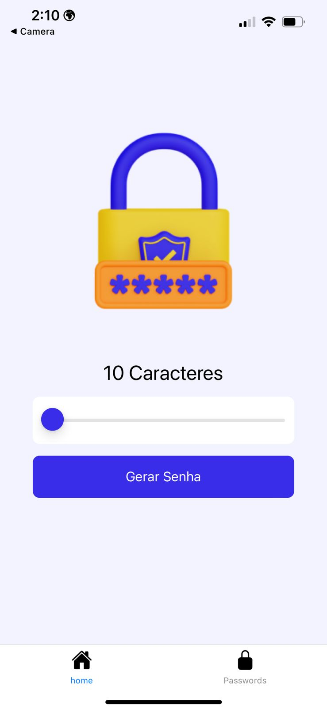
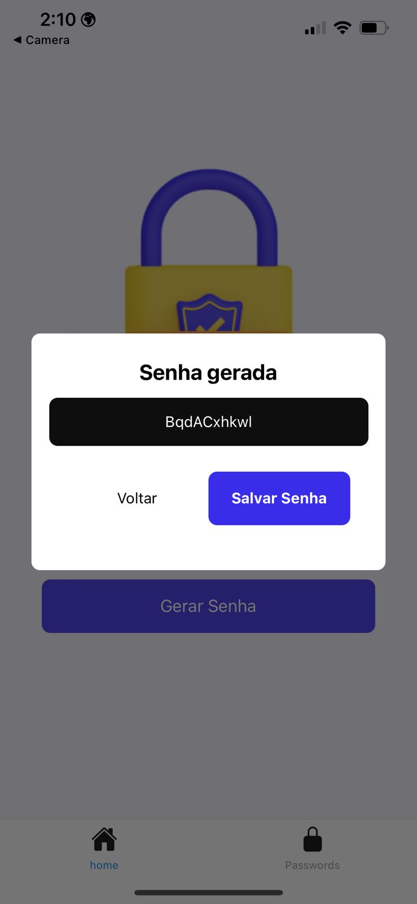
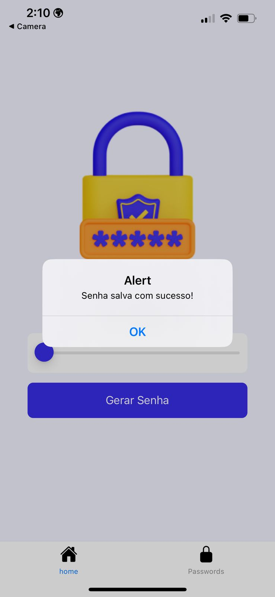
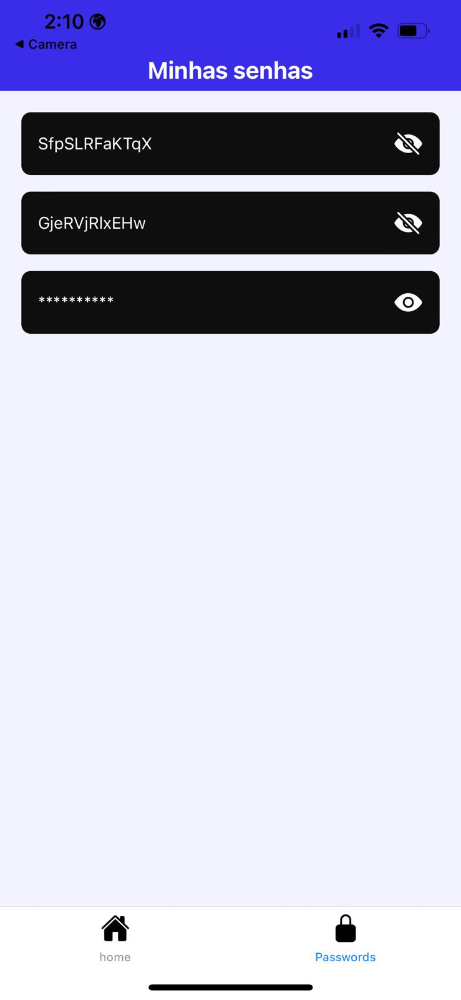

# React Native Password Manager

> App desenvolvido com suporte do tutorial do canal Sujeito Programador. Foi desenvolvido com Expo.

Link do vídeo usado como referência: https://www.youtube.com/watch?v=VDgihqrZUQg
